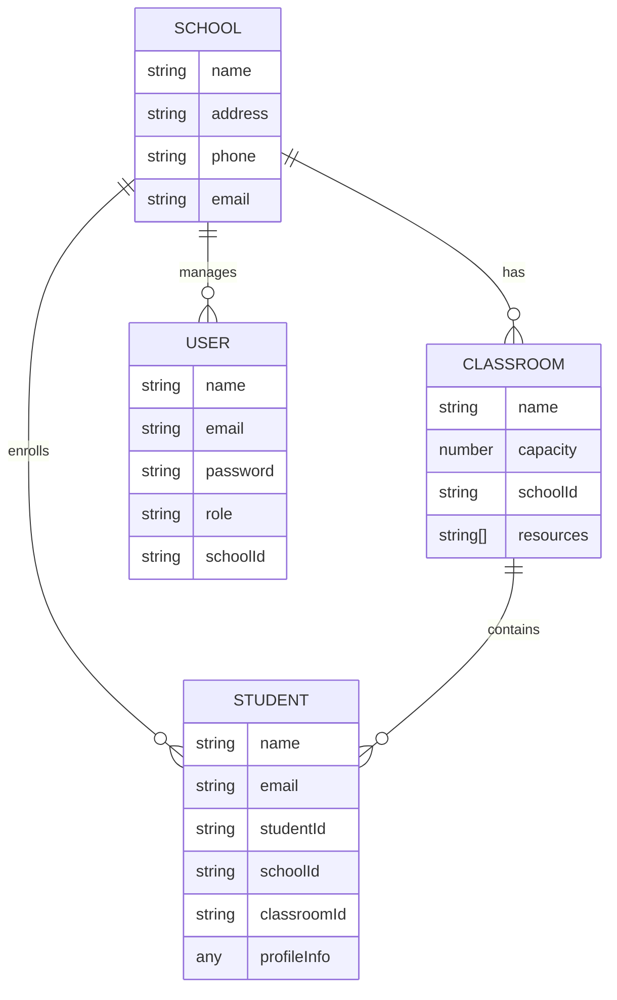

# School Management System API

A robust RESTful API for managing schools, classrooms, and students, built with NestJS, MongoDB, and Redis.

## Table of Contents
- [Features](#features)
- [Technologies](#technologies)
- [Setup & Deployment](#setup--deployment)
- [Authentication Flow](#authentication-flow)
- [Database Schema](#database-schema)
- [API Specifications](#api-specifications)
- [Error Handling](#error-handling)
- [Security Measures](#security-measures)

## Features
- **Authentication & Authorization**: JWT-based auth with Role-Based Access Control (RBAC).
- **School Management**: CRUD operations for schools (Superadmin only).
- **Classroom Management**: Manage classrooms and resources (School Admin only).
- **Student Management**: Enroll students, manage profiles, and track classroom assignments (School Admin only).
- **Caching**: Redis integration for high-performance data retrieval.
- **Security**: Rate limiting, security headers (Helmet), and input validation.

## Technologies
- **Language**: Typescript
- **Framework**: NestJS
- **Database**: MongoDB (Mongoose)
- **Caching**: Redis
- **Documentation**: Swagger/OpenAPI
- **Security**: @nestjs/throttler, Helmet

## Setup & Deployment

### Prerequisites
- Node.js (v18+)
- MongoDB
- Redis

### Installation
1. Clone the repository
2. Install dependencies:
   ```bash
   npm install
   ```
3. Configure environment variables in `.env`:
   ```env
   PORT=3000
   DB_URL=mongodb://localhost:27017/school-mgmt
   JWT_SECRET=your_jwt_secret_here
   REDIS_URL=redis://localhost:6379
   ```

### Running the Application
```bash
# Development
npm run start:dev

# Production Build
npm run build
npm run start:prod
```

### Seeding Initial Data
Creates a default Superadmin: `admin@school.com` / `password123`.
```bash
npm run seed
```

## Authentication Flow
The API uses JWT (JSON Web Tokens) for authentication.
1. **Login**: Send credentials to `POST /auth/login`.
2. **Token**: Receive an `access_token` in the response.
3. **Authorized Requests**: Include the token in the `Authorization` header as `Bearer <token>`.

### Roles
- `SUPERADMIN`: Manages schools and overall system configuration.
- `SCHOOL_ADMIN`: Manages specific school resources (classrooms, students).

## Database Schema


## API Specifications
Full documentation is available via Swagger at `http://localhost:3000/api-docs`.

| Endpoint | Method | Role | Description |
| :--- | :--- | :--- | :--- |
| `/auth/login` | POST | Public | Authenticate and get token |
| `/auth/register` | POST | SUPERADMIN | Register new users/admins |
| `/schools` | POST/GET/PATCH/DELETE | SUPERADMIN | Manage schools |
| `/classrooms` | POST/GET/PATCH/DELETE | SCHOOL_ADMIN | Manage school classrooms |
| `/students` | POST/GET/PATCH/DELETE | SCHOOL_ADMIN | Manage student enrollment |
| `/students/:id/transfer/:cid` | PATCH | SCHOOL_ADMIN | Transfer student between classes |

## Error Handling
The API returns consistent error responses using a global exception filter.

**Format:**
```json
{
  "statusCode": 401,
  "message": "Invalid credentials",
  "timestamp": "2026-02-12T10:00:00.000Z",
  "path": "/api/v1/auth/login"
}
```

## Security Measures
- **Rate Limiting**: 10 requests per minute per IP (Global).
- **Helmet**: Protection against common web vulnerabilities via HTTP headers.
- **Input Validation**: All inputs are strictly validated using `class-validator` and `class-transformer`.
- **CORS**: Enabled for cross-origin resource sharing.
